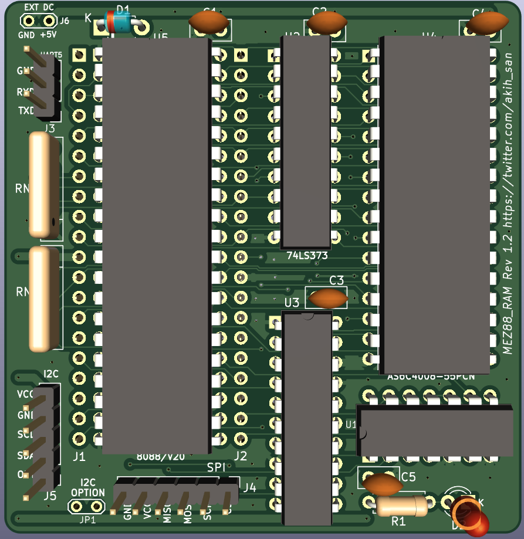
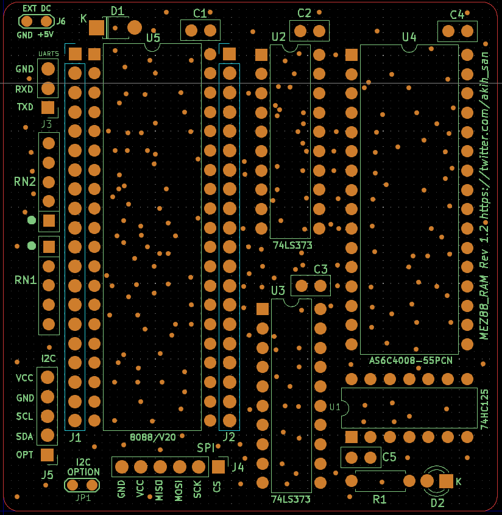
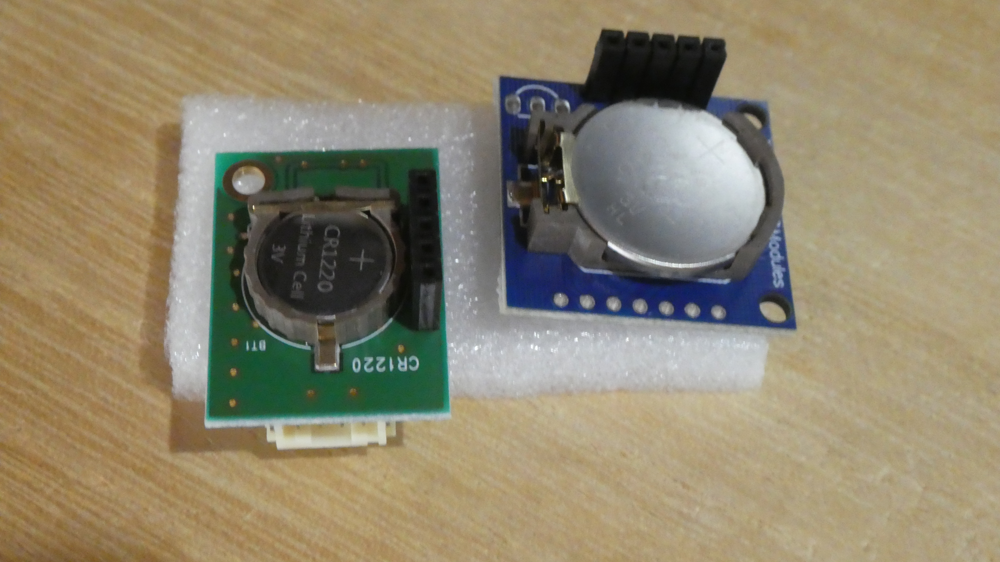

# MEZ88_RAM 
 
EMUZ80は、電脳伝説さんが開発し、公開したSBCです。Z80の制御に、PIC18F57Q43を使用し 
最小限度の部品構成でZ80を動かしています。 
 
＜電脳伝説 - EMUZ80が完成＞   
https://vintagechips.wordpress.com/2022/03/05/emuz80_reference   
 
このことがきっかけで、その後コアな愛好者によって、色々な拡張や 
新しいSBCが公開されています。 
 
今回、このEMUZ80のZ80の代わりに、8088/V20を動かすメザニンボードを 
作成しました。 
メザニンボード上に、8088/V20と、μSDカード用のSPI I/F、リアルタイム 
クロック用のI2C I/F、無手順のUART I/Fを67mm×65mmのPCBに詰め込みました。 
ギリギリの大きさまでPCBを詰めたので、部品をハンダ付けする際には、手順を 
考えないと、ハンダ付けが困難になるくらいの実装密度になっています(-_-;) 
 

MEZ88_RAMを搭載したEMUZ80 

MEZ88_RAM拡大 

# 特徴 
 
・動作CPU : Intel8088 CPU（その他互換CPU)、またはNEC V20(μPD70108) 5MHz/8MHz 
・512K SRAM搭載(AS6C4008-55PCN) 
・μSDカードI/F（SPI) 
・I2C I/F (RTC)リアルタイムクロック：DS1307をサポート）（注） 
・UART（9600bps無手順） 
・動作OS : CP/M-86 または MS-DOS V2.11（起動時に選択可能） 
 
（注） 
I2Cの制御ドライバは、EMU57Q-8088/V20のファームウェアを流用しています。 
その為、USB-UARTに接続するモジュール（FT200-XD)を認識します。しかし、MEZ88_RAM 
ではI2Cのポートを１つしか実装していないため、RTCのみをサポートしています。 
 
EMU57Q-8088/V20については、以下を参照してください。 
 
公開した時系列順です。 

・https://github.com/akih-san/EMU8088_57Q_CPM86 
・https://github.com/akih-san/EMU8088_MSDOS211 
・https://github.com/akih-san/EMU8088_57Q_V2_CPM86 
・https://github.com/akih-san/EMU57Q-Rrv2.1_CPM_MSDOS 

MEZ88_RAM実装イメージ 

MEZ88_RAMシルク画像 

# ファームウェア（FW）
@hanyazouさん(https://github.com/hanyazou) が作成したZ80で動作しているCP/M-80のFWを 
ベースに、MEZ88_RAM用のFWとして動作するように修正を加え、CP/M-86、MS-DOSを 
インプリメントしました。 
 
MS-DOSのデバイスドライバの本体はPICのFW側で実現しています。 
DISK I/OとFatFs、及びSPIについては、EMU8088_57QのFWほぼ未修整で使用しています。 
 
I2Cが使えるのは、MS-DOSのみとなっています。CPM-86では扱っていません。 
 
I2Cのサポートについては、@etoolsLab369さんのページが非常に参考になりました。 
感謝いたします。 
 
（18F27Q43 2台を使ってHost-Client通信） 
https://qiita.com/etoolsLab369/items/65befd8fe1cccd3afc33 
 
 
＜DS1307を使ったRTCモジュール＞

AE-DS1307：　秋月電子通商で入手できます。 
https://akizukidenshi.com/catalog/g/g115488/ 
 
Tiny RTC modules：　amazon、その他有名webストアで入手できます。 
説明書も何もありませんが、amazonに図面入りのレビューがありました。 
 
 
# IO.SYSの開発環境
IO.SYSの開発は、マイクロソフト社マクロアセンブラ（MASM）V5.0Aを使用しています。 
開発には、セルフで開発できる環境か、MS-DOSエミュレーターが動作する環境が必要です。 
 
EMU8088のIO.SYSの開発には、Windows上で動くエミュレーターとして有名なmsdos playerを 
使用させていただきました。開発者のtakeda氏に深く感謝致します。 
 
＜MSDOS Playerの場所＞ 
http://takeda-toshiya.my.coocan.jp/msdos/
 
こちらも、参考になるかと。 
http://iamdoingse.livedoor.blog/archives/24144518.html

# その他で使用した開発ツール
FWのソースのコンパイルは、マイクロチップ社の 
 
「MPLAB® X Integrated Development Environment (IDE)」 
 
を使っています。（MPLAB X IDE v6.20）コンパイラは、XC8を使用しています。 
https://www.microchip.com/en-us/tools-resources/develop/mplab-x-ide 
 
universal moniter 8088/V20は、Macro Assembler AS V1.42を使用してバイナリを 
作成しています。 
 
Macro Assembler 1.42 Beta [Bld 269] 
(i386-unknown-win32) 
(C) 1992,2024 Alfred Arnold 
 
http://john.ccac.rwth-aachen.de:8000/as/ 
 
FatFsはR0.15を使用しています。 
＜FatFs - Generic FAT Filesystem Module＞ 
http://elm-chan.org/fsw/ff/00index_e.html 
 
SDカード上のCP/Mイメージファイルの作成は、CpmtoolsGUIを利用しています。 
＜CpmtoolsGUI - neko Java Home Page＞ 
http://star.gmobb.jp/koji/cgi/wiki.cgi?page=CpmtoolsGUI 
 
SDカード上のMS-DOSイメージファイルの作成は、ImDisk Virtual Disk Driverを利用しています。 
ここで、紹介されています。 
https://freesoft-100.com/review/imdisk-virtual-disk-driver.html
 
本家は、ここです。 
http://www.ltr-data.se/opencode.html/#ImDisk
 
＜＠hanyazouさんのソース＞ 
https://github.com/hanyazou/SuperMEZ80/tree/mez80ram-cpm 
 
＜@electrelicさんのユニバーサルモニタ＞ 
https://electrelic.com/electrelic/node/1317 
 
 
# 参考
・EMUZ80 
EUMZ80はZ80CPUとPIC18F47Q43のDIP40ピンIC2つで構成されるシンプルなコンピュータです。 
＜電脳伝説 - EMUZ80が完成＞   
https://vintagechips.wordpress.com/2022/03/05/emuz80_reference   
 
＜EMUZ80専用プリント基板 - オレンジピコショップ＞   
https://store.shopping.yahoo.co.jp/orangepicoshop/pico-a-051.html 
 
・SuperMEZ80 
SuperMEZ80は、EMUZ80にSRAMを追加し、Z80をノーウェイトで動かすことができるメザニンボードです 
 
＜SuperMEZ80＞ 
https://github.com/satoshiokue/SuperMEZ80 
 
