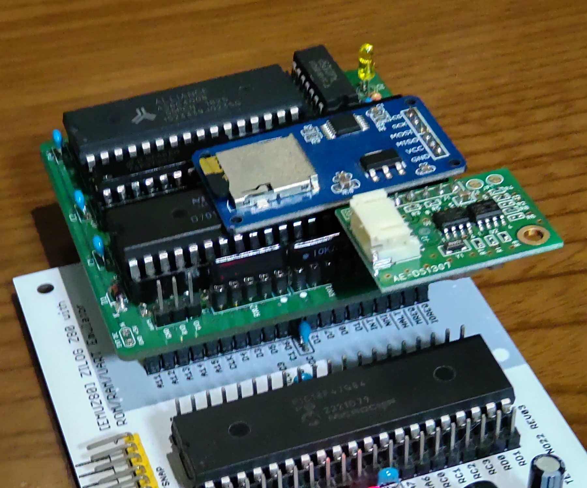
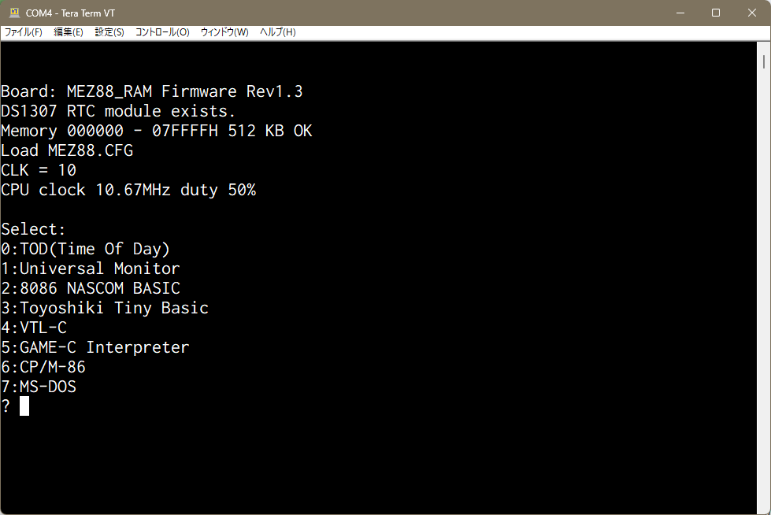
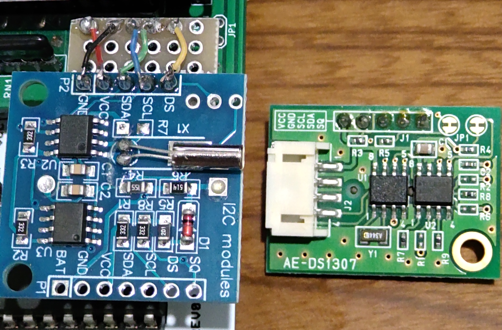
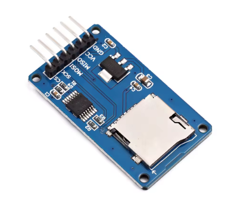
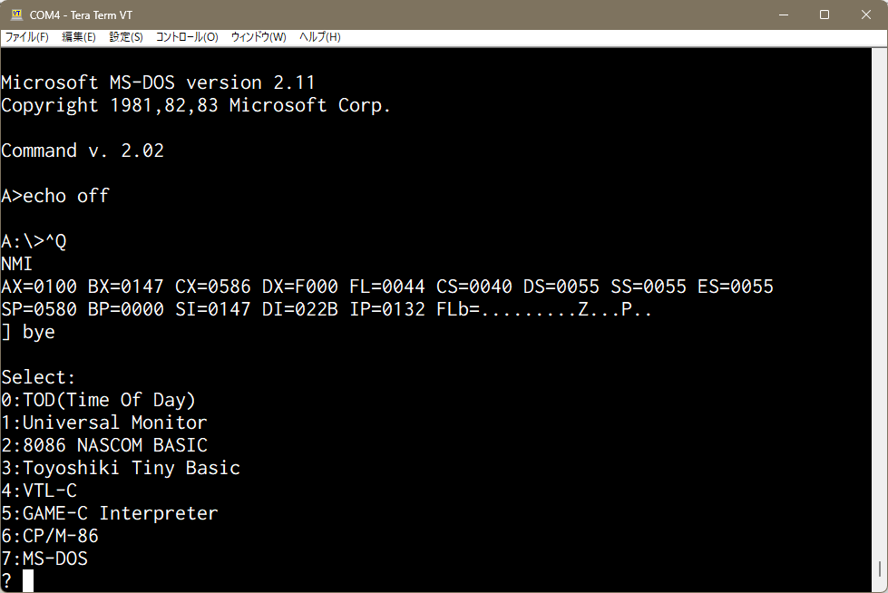

# MEZ88_RAM Firmware Rev1.3

MEZ88_RAM Rev1.2は[EMUZ80](https://vintagechips.wordpress.com/2022/03/05/emuz80_reference/)ボード上で動く8088/V20メザニンボードです。
Firmware Rev1.3は、MEZ86_RAM Firmware Rev1.1をMEZ88_RAMに移植したものです。

（MEZ88_RAM Rev1.2メザニンボード）
 

# １．起動画面
MEZ88_RAM Rev1.3を起動すると、初期化終了後に、プログラムの選択待ちになります。
 

# ２．特徴
・動作CPU : Intel8088 CPU（その他互換CPU) 5MHz/8MHz/10MHz、または、NEC V30(μPD70116) 8MHz/10MHz 
・Microcontroller : PIC18F47Q43, PIC18F47Q84, PIC18F47Q83（注1） 
・512KB SRAM搭載(AS6C4008-55PCN 1個) 
・μSDカードI/F（SPI) 
・I2C I/F (RTC)リアルタイムクロック：DS1307をサポート）（注2） 
・UART3（9600bps無手順） メインコンソール用 
・UART5（9600bps無手順） MS-DOS AUXデバイス用 
・コンソールキー（Ctrl-Qを2回連続入力）によるNMI割込みのサポート（注3） 
・動作プログラム : 後述  
（注1） 
　PIC18F47QXXから512KBメモリをアクセスするために、8088/V20のALE信号に 
　ゲートロジックを通しています。 
　16MHzまでクロックの設定が出来ますが、10MHzまでしかテスト出来ていません。 
（注2） 
　I2Cの制御ドライバは、[EMU57Q-8088/V20](https://github.com/akih-san/EMU57Q-Rrv2.1_CPM_MSDOS)のファームウェアを流用しています。 
（注3） 
　NMI割込みで、常駐プログラムのモニター（Universal Monitor）が起動します。 
　モニターのbyeコマンドで、CPU側にリセットをかけてファームウェアの入力待ちに戻ることが出来ます。 

# ３．RTC(DS1307)モジュール
DS1307を使ったAE-DS1307モジュールをサポートしています。 
（AE-DS1307モジュールは、現在、秋月電子通商で販売していないようです。）
他に、MEZ86_RAMでサポートしているTiny RTC moduleが使えます。
Tiny RTC moduleはArduinoで使用可能で、amazon, AliExpress等のから入手することができます。 
ただし、ピン配置が違うので変換アダプタを作成する必要があります。 

(rtc_modules) 

 
日時の設定は、ファームウェア起動時のセレクトリスト0番（TOD）で指定します。 
もしくは、MS-DOSのdate, timeコマンドで設定することが出来ます。 
RTC(DS1307)モジュールが接続されていない場合、PICのtimer0の10msタイマーを用いて、 
日時をカウントします。その場合、電源OFFで日時が2025/06/01 00:00:00にリセットされます。 

# ４．μＳＤカードモジュール
SPIで制御されるμＳＤカードモジュールは、Arduinoで使用可能で、amazon, AliExpress等のから入手することができます。 

(μSD Card module) 

# ５．動作プログラム
 ・Universal Monitor 
 ・8086 NASCOM BASIC 
 ・Toyoshiki Tiny Basic 
 ・VTL-C 
 ・GAME-C Interpreter 
 ・CP/M-86 
 ・MS-DOS 

Universal Monitorは、単体で起動できますが、他のプログラムを起動したときには、
常駐モニターとしてロードされます。 
プログラム終了時や、（Ctrl+Qキーを2回連続入力で）NMI割込みを発生させると、 
常駐モニターに制御が移ります。モニターのbyeコマンドで、CPUにリセットをかけ 
ファームウェアの選択画面に戻すことができます。 
 

(例：MS-DOSを終了しファームウェアに戻る) 

# ６．PIC18F47QXXへの書き込み
PICへの書き込みツールを用いて、Hexファイルを書き込みます。 
- PIC18F47Q43 
　　Q43R1.3.hex 
- PIC18F47Q84 
　　Q84R1.3.hex 
- PIC18F47Q83 
　　Q83R1.3.hex 
 
＜使用確認した書き込みツール＞ 
 
- snap(マイクロチップ社の書き込みツール) 

  - [snap](https://www.microchip.com/en-us/development-tool/PG164100)

 
- PICkit3（または互換ツール）  
  PICkitminus書き込みソフトを用いて、書き込むことが出来ます。以下で入手できます。 

  - [PICkitminus](https://github.com/jaka-fi/PICkitminus)

# ７．μＳＤカードの作成
μSDカードはFAT32を使用しています。4G～16GBまでのＳＤカードで動作確認を行いました。DISKSフォルダ内の以下のフォルダとファイルを、FAT32でフォーマットされた
μSDカードにコピーします。 
 
＜フォルダ＞ 
　・CPMDISKS 
　・DOSDISKS 
 
＜ファイル＞ 
　・BASIC_86.BIN		（8086 NASCOM BASIC） 
　・GMI_S88.BIN			（GAME-86 インタプリタ） 
　・TT_BAS88.BIN		（豊四季タイニーベーシック） 
　・UMON_S88.BIN		（86版ユニバーサルモニタ） 
　・VTL_S88.BIN			（Very Tiny Language） 
　・MEZ88.CFG			（MEZ88_RAM コンフィグファイル） 

# ８．MEZ88_RAM詳細データ
  - [図面](pdf/MEZ88_RAM図面.pdf)
  - [部品表](https://github.com/akih-san/MEZ88_RAM/blob/Rev1.3/pdf/%E3%83%94%E3%83%B3%E3%82%A2%E3%82%B5%E3%82%A4%E3%83%B3%20%20-%20MEZ8847Q.pdf)
  - [PICピンアサイン](https://github.com/akih-san/MEZ88_RAM/blob/Rev1.3/pdf/%E3%83%94%E3%83%B3%E3%82%A2%E3%82%B5%E3%82%A4%E3%83%B3%20%20-%20MEZ8847Q.pdf)
  - [Gerberデータ](gerber)

## 謝意
MEZ88_RAMで動作するプログラムの多くは、元となる情報を公開されている方々のソースコードから移植しています。 
とても有難く使わせてもらい、感謝しています。 
  - [「VTL(Very Tiny Language)の作成」](https://middleriver.chagasi.com/electronics/vtl.html)
  - [超ミニ言語で遊ぼう（４）みんなで「スタ☆トレ」](https://ameblo.jp/siropyon/entry-11917965564.html)
  - [Universal Monitor](https://electrelic.com/electrelic/node/1317)
  - [豊四季タイニーベーシック](https://vintagechips.wordpress.com/2015/12/06/%E8%B1%8A%E5%9B%9B%E5%AD%A3%E3%82%BF%E3%82%A4%E3%83%8B%E3%83%BCbasic%E7%A2%BA%E5%AE%9A%E7%89%88/)
  - [「GAME」という名のプログラミング言語](https://ameblo.jp/takeoka/entry-11004344172.html)
  - [PIC24FJ64GAでGAME言語]（その５）](https://piclabo.seesaa.net/article/2015-10-01.html)
  - [Maze for GAME80](https://piclabo.seesaa.net/category/28042960-28.html)
    （★2019/05/03　追記の部分です） 

## 参考
### EMUZ80 
EMUZ80はMicrochip社のPIC18F47Q43/83/84を使用して、Z80を制御するシングルボードコンピュータ
です。また、Z80の代わりにメザニンボードを装着することで、レガシーCPU（68008や、8086、V30、他）
を動かすことが出来ます。 
　　[電脳伝説 - EMUZ80が完成](https://vintagechips.wordpress.com/2022/03/05/emuz80_reference) 
UART, SPI, I2C等の制御をPICで行い、レガシーCPUの外部I/Oとして機能を提供します。
SDカードはSPIを通して実装されています。 
PICから、レガシーCPUのメモリ空間にアクセスすることで、レガシーPCのプログラムをロードする
ことが出来るため、ROMは必要なくSRAMでプログラムを動作させることが出来ます。 
### SBCV20 
[SBCV20](https://vintagechips.wordpress.com/category/8088-v20/)
は[電脳伝説](https://vintagechips.wordpress.com/)さんによって作成されたSBCです。 
　　[SBCV20の技術資料](http://www.amy.hi-ho.ne.jp/officetetsu/storage/sbcv20_techdata.pdf) 
　　[SBCV20の入手先](https://store.shopping.yahoo.co.jp/orangepicoshop/pico-a-037.html) 
### SuperMEZ80 
[SuperMEZ80](https://github.com/satoshiokue/SuperMEZ80)は、EMUZ80にSRAMを追加しZ80をノーウェイトで動かすことができます。
### ＠hanyazouさんのソース 
https://github.com/hanyazou/SuperMEZ80/tree/mez80ram-cpm 
### @electrelicさんのユニバーサルモニタ 
https://electrelic.com/electrelic/node/1317 
### オレンジピコショップ 
オレンジピコさんでEMUZ80、その他メザニンボードの購入できます。 
 
https://store.shopping.yahoo.co.jp/orangepicoshop/pico-a-051.html 
https://store.shopping.yahoo.co.jp/orangepicoshop/pico-a-061.html 
https://store.shopping.yahoo.co.jp/orangepicoshop/pico-a-062.html 
https://store.shopping.yahoo.co.jp/orangepicoshop/pico-a-079.html 
https://store.shopping.yahoo.co.jp/orangepicoshop/pico-a-087.html 
